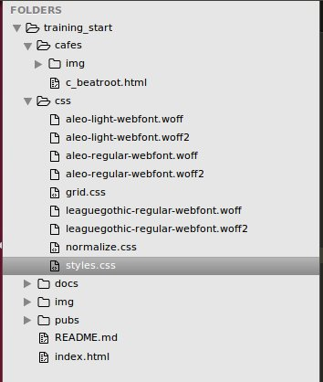

# Git scenarios
##1. Hotfix
Check out the branch *pub_kensington_arms*. Do some work on it, for example add a file for the pub in the pub directory, or change some styles. While you are working away, you are told you need to fix something on the *development* branch: You need to change the colour of the main heading to orange. How best to do that without losing your current changes?
##2. I should have branched!
Check out the *development* branch and look at the recent commits. You realise that the last three commits should have rather gone on a new branch *new_header_styles* with the last commit in the *development* branch being "add paragraph under heading on homepage" - you could also rename that commit to something nicer.
##3. Merging
You are on the *pub_kensington_arms* branch. Merge in the *development* branch.
##4. Clear up that mess
Check out the *cafe_btp* branch and check the recent commits. Can this be tidied up a bit?
   
 
# Contributing to the cafes and pubs directory
Below is the file structure of this repo. Let's try and add some cafes and pubs. Use the cafes/c_beatroot.html file as a template for a page about your cafe or pub. Also add it to index.html. You can also change some styles of course. Then we will somehow need to get the changes into the remote..
 

